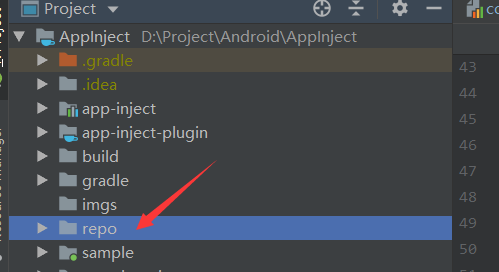

# AppInject

A lightweight cross-module dependency-injection library for Android.

- AppInject aar library

[  ](https://bintray.com/liuyuchuan/maven/app-inject/0.2.0/link)

- AppInject gradle plugin

[  ](https://bintray.com/liuyuchuan/maven/app-inject-plugin/0.3.0/link)

## Import

Root project's `build.gradle`:

``` groovy
buildscript {
    repositories {
        //...
        jcenter()
    }
    dependencies {
        // ...
        classpath "com.lyc:app-inject-plugin:latest.release"
    }
}
```

In your `app` module (module to output apk), `build.gradle`:

``` groovy
apply plugin: 'com.android.application'
// must be applied after 'application' plugin
apply plugin: "com.lyc.app-inject-plugin"

dependencies {
    // provide Annotations and AppInject API
    implementation "com.lyc:app-inject:latest.release"
}
```

It's recommond to provide AppInject API in base module as follow:

``` groovy
dependencies {
    // pass dependency to other modules
    api "com.lyc:app-inject:latest.release"
}
```

## Use

Define your interface(`api`) in `module A`. For example:

> Or abstract class.
> `@InjectApi` supports both abstract class and interface.

``` java
// oneToMany default value is false
// if oneToMany == true
// you can create more than one implementation class of this interface
// else you can only create one class
@InjectApi(oneToMany = false)
public interface ITestApi {
    String logMsg();
}
```

Implement this interface (or extends class) in **any module**. We call it `module B`:

``` java
@InjectApiImpl(api = ITestApi.class)
public class TestApiImpl implements ITestApi {
    @Override
    public String logMsg() {
        return "I'm TestApiImpl!";
    }
}
```

Now you can get instance of ITestApi at any module which depends on `module A`. No need to depend on `module B`:

``` kotlin
// use AppInject.getInstance().getOneToManyApiList() if oneToMany == true
val testApi = AppInject.getInstance().getSingleApi(ITestApi::class.java)
Log.d(TAG, testApi.logMsg())
```

## Kotlin Simplify

Use kotlin can simplify call to `AppInject`, for example:

``` kotlin
inline fun <reified T> getSingleApi(): T? {
    return AppInject.getInstance().getSingleApi(T::class.java)
}

inline fun <reified T> getOneToManyApiList(): List<T> {
    return AppInject.getInstance().getOneToManyApiList(T::class.java)
}
```

use it:

``` kotlin
val testApi = getSingleApi<ITestApi>()
// or
val testApi:ITestApi? = getSingleApi()
```

## Proguard

[Proguard File](./progurad.pro)

``` proguard
# for createMethod getInstance()
-keepclasseswithmembers @com.lyc.appinject.annotations.ServiceImpl class * {
    public static * getInstance();
}
-keepclasseswithmembers @com.lyc.appinject.annotations.ExtensionImpl class * {
    public static * getInstance();
}
```

## Run this project in local

**Step1** Modify file `common.properties` at root directory.

``` properties
testInjectPluginLocal=false
testRemoteRepo=false
```

**Step2** Run `gradle updateArchives` to build and publish to local maven (directory `repo` at root directory). `repo` directory should be created.



**Step3** Modify file `common.properties` at root directory.

``` properties
testInjectPluginLocal=true
```

**Step4** Gradle sync. Now you can run `sample` module.

## License

[License.md](./LICENSE.MD)
